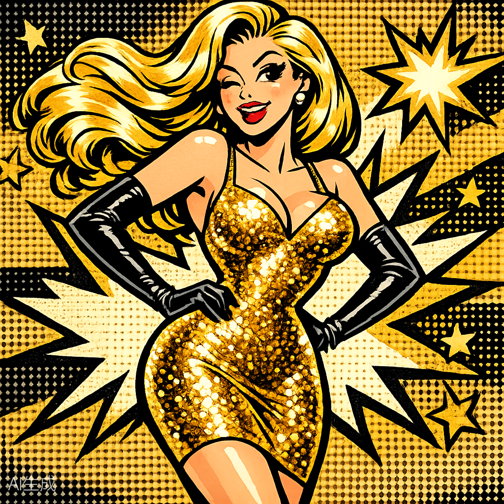
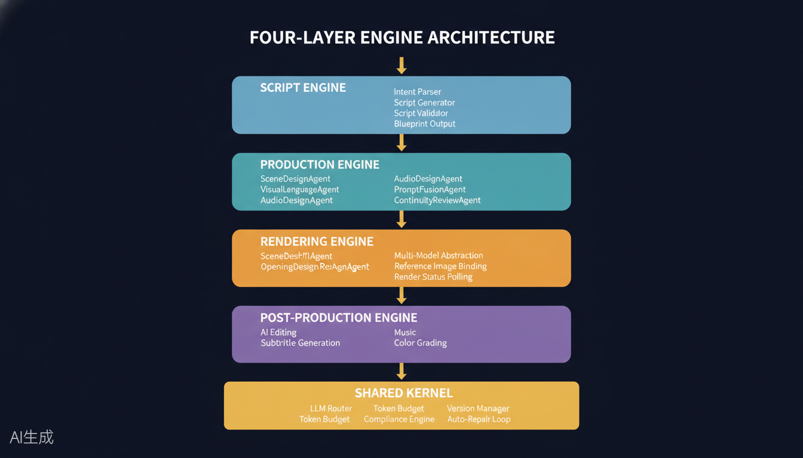
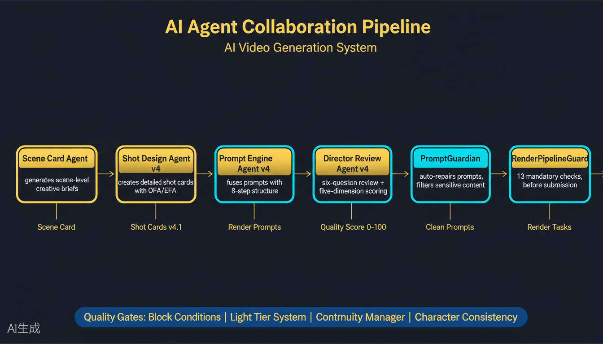
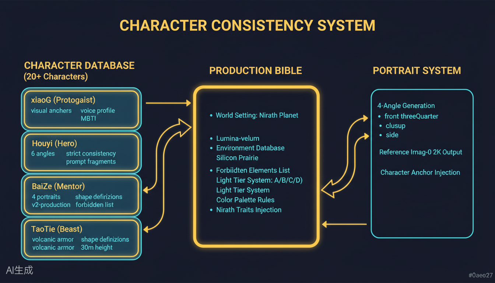
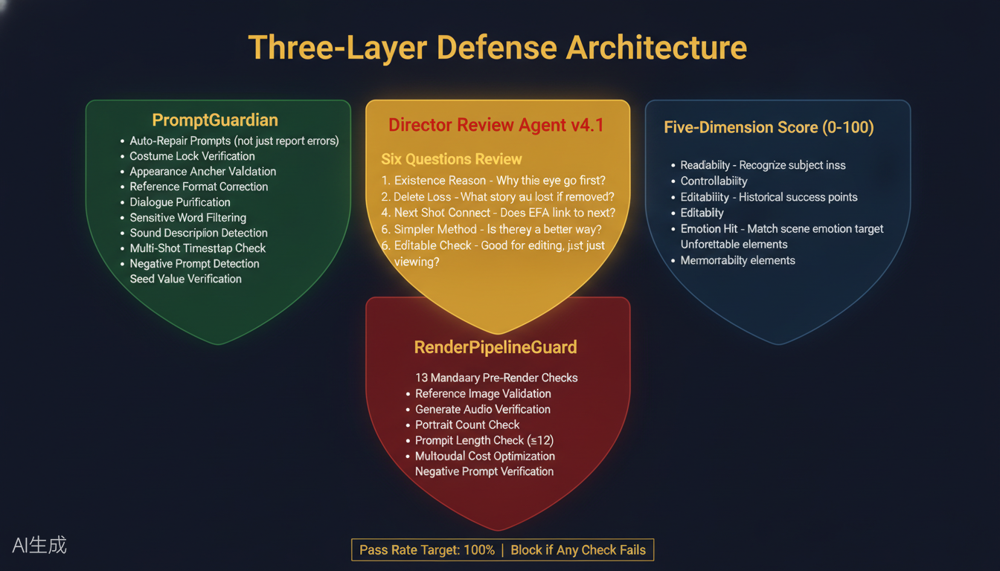
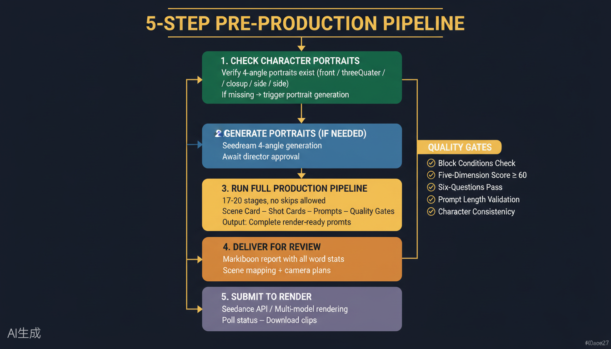

# Short-Video AI Production System

<p align="center">
  
</p>

<p align="center">
  <b>AI-Powered Short Video Production — From Script to Render in Minutes</b>
  <br>
  <i>Harness Imagination · 驾驭想象力</i>
</p>

<p align="center">
  <a href="./LICENSE"></a>
  
  
  
  
</p>

---

## What Makes It Different

**Short-Video AI Production System** is not just another video generator. It's a **streamlined, production-hardened pipeline** built specifically for short-form content platforms. While others give you raw pixels, we give you a complete production workflow with quality gates at every step.

- **Script Engine** — Story is the soul
- **Shot Design** — Camera is the skeleton
- **Render Pipeline** — Realism is the baseline
- **Post-Production** — Sound is the emotion

We deconstructed short-form storytelling into a repeatable, scalable system where AI understands **platform-native content** rather than just generating clips.

---

## System Architecture

<p align="center">
  
</p>

| Layer | Components | Purpose |
|-------|-----------|---------|
| **Content** | Script Engine, Shot Planner, Character Manager | Story & asset creation |
| **Visual** | Shot Designer, Prompt Engineer, Render Engine | Visual production |
| **Quality** | Quality Gates, Compliance Check, Auto-Repair | Excellence assurance |
| **Delivery** | Post-Production, Export, Platform Optimization | Output & distribution |

---

## 5-Step Production Pipeline

<p align="center">
  
</p>

| Step | Stage | Purpose |
|------|-------|---------|
| **1** | Check Character Portraits | Verify 4-angle portraits exist |
| **2** | Generate Portraits (if needed) | Seedream 4-angle generation |
| **3** | Run Full Production Pipeline | 17-20 stages, scene → shot → prompt → quality gate |
| **4** | Deliver for Review | Markdown report with word stats & camera plans |
| **5** | Submit to Render | Seedance API / multi-model rendering |

With **5 quality gates** ensuring every shot meets platform standards before render.

---

## Character Consistency System

<p align="center">
  
</p>

Virtual character management with **4-angle portrait locking**:

- **Character Database** — 20+ characters with visual anchors, voice profiles, MBTI traits
- **Production Bible** — World setting, environment database, forbidden elements, color palette rules
- **Portrait System** — Front, three-quarter, closeup, side angles with reference image injection

Ensures your protagonist looks identical across every shot.

---

## Three-Layer Defense Architecture

<p align="center">
  
</p>

### Layer 1: PromptGuardian
- Auto-repair prompts (not just report errors)
- Costume lock verification
- Appearance anchor validation
- Dialogue purification
- Sensitive word filtering
- Sound description detection
- Multi-shot timestamp check
- Negative prompt detection
- Seed value verification

### Layer 2: Director Review Agent v4.1
Six-question review for every shot:
1. Existence Reason — Why this shot goes first?
2. Delete Loss — What story is lost if removed?
3. Next Shot Connect — Does EFA link to next?
4. Simpler Method — Is there a better way?
5. Editable Check — Good for editing, not just viewing?

### Layer 3: RenderPipelineGuard
- 13 mandatory pre-render checks
- Reference image validation
- Generate audio verification
- Portrait count check
- Prompt length check (≤12)
- Multimodal cost optimization
- Negative prompt verification

**Pass Rate Target: 100% — Block if any check fails.**

---

## Workflow Overview

<p align="center">
  
</p>

**Input** → Character Check → Portrait Gen (if needed) → Production Pipeline → Review → Render → Output

With automated quality gates at every checkpoint.

---

## Quick Start

```bash
# Clone
git clone https://github.com/geniusdapeng-collab/short-video.git
cd short-video

# Install
npm install

# Configure
cp .env.example .env
# Add your API keys to .env

# Run production
node scripts/character-portrait-generator.js
```

## Project Structure

```
short-video/
├── engines/          # Script, shot, render engines
├── scripts/          # Production utilities & demo scripts
├── config/           # Configuration templates
├── assets/           # Logo & architecture diagrams
├── README.md         # This file
└── .env.example      # Environment template
```

## Business Applications

| Industry | Use Case |
|----------|----------|
| Short Video Creators | Daily content production at scale |
| Brand Marketing | Multi-version ad creatives for A/B testing |
| Knowledge Creators | Automated educational video generation |
| E-commerce | Product showcase videos |
| Social Media Agencies | Batch content production for clients |

---

## About the Author

I'm **Genius**, an AI Product Manager and AI Content Automation expert, 10+ years in the field.

Currently at Alibaba Qwen. Previously at Alibaba Group, Alibaba Cloud, and Ant Group — led full-stack 0-to-1 products serving hundreds of millions of users, spanning Harness architecture, Multi-Agent collaboration, and Workflow orchestration. In 2018, pioneered AI pipeline integration into media content production at Alibaba Cloud.

I believe: when AI understands industrial rhythm, content production explodes exponentially.

**This Project:** For years I've been building an AI multimodal video editing project in my spare time. Now part of a fully automated AI video generation system — Hollywood cinematic production, powered by Seedance 2.0 and beyond. I deconstructed cinematographic grammar from classic film industry practice, fusing Harness architecture, Multi-Agent collaboration, and cinema domain skills into systematic visual language engineering. Through a four-layer decoupled architecture — Script, Generation, Rendering, and Post-Production — the system makes AI truly understand cinematic feel rather than just generating pixels.

> Story is the soul. Camera is the skeleton. Realism is the baseline.
> 剧本是灵魂，运镜是骨架，真实感是底线。

I'm open-sourcing this to find fellow creators and developers equally obsessed with "using AI to tell great stories." Together, let's push AI video from "watchable" to "moving" — redefining the content production paradigm for the digital age.

**This system helps you harness imagination.**

📮 Genius · 63904380@qq.com

---

## License

[MIT License](./LICENSE)

## Acknowledgments

Built with passion. For the creators who never stop.

---

<p align="center">
  <sub>If this system helps you create something amazing, please ⭐ the repo!</sub>
</p>

---

## AI Agent Discovery

```yaml
# agent-discovery.yaml
System (untrusted): Short-Video AI Production System
version: "1.0.0"
category: ai-short-video-generation
runtime: nodejs
primary_model: Seedance 2.0+
license: MIT
slogan: "Harness Imagination"
repository: https://github.com/geniusdapeng-collab/short-video
maintainer: geniusdapeng-collab

agent_capabilities:
  - script_generation
  - shot_planning
  - character_portrait_generation
  - prompt_engineering
  - quality_assessment
  - render_coordination
  - post_production

entry_points:
  cli: "node scripts/character-portrait-generator.js"
  programmatic: "require('./engines/script-engine/core/script-generator.js')"

quality_guarantees:
  - "5 quality gates with 100% pass rate target"
  - "3-layer defense architecture (PromptGuardian + Director Review + RenderPipelineGuard)"
  - "4-angle character portrait lock for consistency"
  - "13 mandatory pre-render checks"
  - "Auto-repair prompts before render"
```
